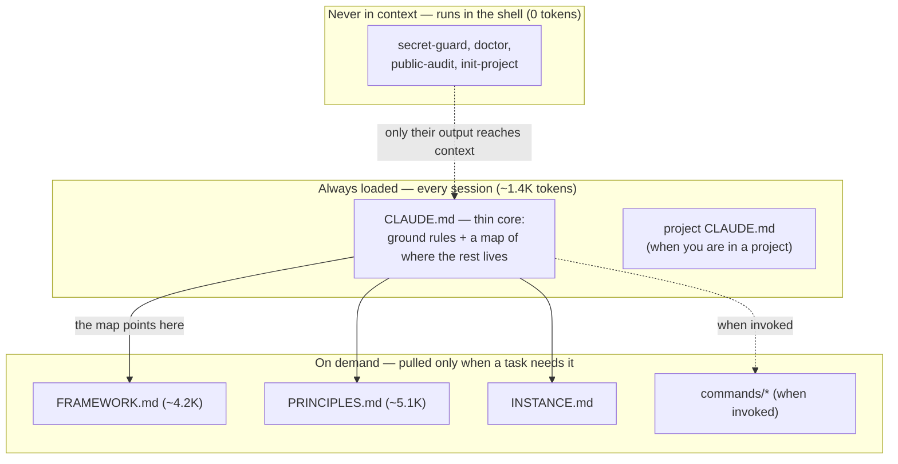

# Keel

[](https://github.com/rockerlabs/keel/actions/workflows/ci.yml)
[](LICENSE)

> **In plain words:** a short "how I work" file your AI coding assistant reads at the start of every
> session — so it stops re-learning your project, your conventions, and the decisions you already made —
> plus a few small Bash tools that block secrets and check your setup. Works with any AI tool, not just
> Claude. About 10 minutes to set up.

**AI assistants start every session from zero.** Each new chat re-figures-out your project, your habits,
and choices you already settled — and if you paste in everything to make up for it, the assistant drowns in
detail and grabs the wrong fact. Keel is the middle path: a small, tool-independent layer that decides
**what your assistant loads, when, and how much** — so the knowledge and judgment you build up don't get
thrown away every time the tools change.

## Quickstart

**1. Install.** Copies the small always-on file into `~/.claude`, turns on the **secret-guard** check
(stops key-shaped secrets from being committed or pushed), and adds the `/wrap` `/go` `/init-project`
commands — **without overwriting any file you already have.** (Needs `bash` + `git` — nothing else.)

```bash
git clone https://github.com/rockerlabs/keel.git && cd keel && ./install.sh
```

**2. Open Claude Code in your own project and let it finish the setup — no editing by hand.** Open
**your own project** (not the `keel` folder you just cloned) in Claude Code — **if Claude Code was already
open, restart it**, because new commands only show up when a session starts. Then run `/keel-setup`: it
fills in your machine details, **writes a first draft of that project's `CLAUDE.md` from its own code**, and
sets up the ground rules — you *check* the draft, you don't write it. Run it once per project you want Keel
on.

```
/keel-setup
```

Two steps. After step 1, secret-guard already protects your commits; `/keel-setup` does the rest, and you
just review what it drafts. (Still don't see `/keel-setup`? You're in an old session — start a fresh one.)

*Want to see it work before installing?* `./examples/tour.sh` runs a safe demo in a throwaway sandbox
(touches nothing on your machine): it sets up a sample project and watches secret-guard block a real key.

That's the whole loop. Longer walk-through, other AI tools, and the honest "what runs by itself vs what's up
to you" → [docs/getting-started.md](docs/getting-started.md).

> **Not using Claude Code?** Keel doesn't depend on it. The ideas, the `tools/`, and the always-on file
> work with any AI coding tool (Cursor, Aider, Codex, a plain API agent, …). The one Claude-Code-specific
> bit is the slash commands. See [`ADAPTING.md`](ADAPTING.md) for a short non-Claude setup — and, if you
> get it running on another tool, a quick way to share how.

> **Status: early experiment.** This is an early, cleaned-up copy of one person's working setup. It's
> public to find out whether it helps anyone besides its author — not as a finished product. Feedback
> welcome; expect rough edges.

## The idea

Keel rests on three plain ideas:

1. **Load a little always, the rest on demand.** A small, stable core loads every session; everything else
   is pulled in only when a task actually needs it. That's what lets it work even when the assistant's
   working memory is small.
2. **Some things last, some don't.** Tools go out of date in a year; your judgment and project decisions
   don't. Put your effort into the lasting part, and keep the machinery thin and easy to swap out.
3. **Add a rule only when something hurts.** Every rule has to fix a real problem you actually ran into —
   not just be there to look complete. That's what keeps it from turning into red tape.

The foundation is in [`PRINCIPLES.md`](PRINCIPLES.md); the reusable how-to is in
[`FRAMEWORK.md`](FRAMEWORK.md). For exactly what loads when — and what it costs in tokens, with a
with/without comparison — see [`docs/loading-and-cost.md`](docs/loading-and-cost.md).

### How it loads, at a glance



The always-on part stays tiny; the bigger files (`PRINCIPLES`, `FRAMEWORK`) wait behind a door and load only
when needed; the tools never enter the assistant's memory at all. That's the whole point.

## What's in the box

| | |
|---|---|
| `PRINCIPLES.md` | The lasting foundation — the handful of ideas everything else rests on. Read it for big, hard-to-undo decisions. |
| `FRAMEWORK.md` | The reusable how-to: load-a-little-always, the project list, keeping the always-on part small, plus git and code conventions. No personal data. |
| `templates/CLAUDE.md` | The small always-on file — copy it into your AI tool's config folder (e.g. `~/.claude/`) and edit it. |
| `templates/INSTANCE.md` | Your private personal layer (hardware, which models you can use, your list of projects). |
| `templates/project-CLAUDE.md` | A template for per-project notes. |
| `templates/LEARNINGS.md` | A holding place for workflow tips that aren't yet worth a full rule (between "make it a rule" and "drop it"). |
| `install.sh` | One-command setup: copies the always-on files into your config folder and turns on the secret-guard check. Safe to re-run — never overwrites your files. |
| `tools/doctor.sh` | Checks a project's setup for missing pieces. |
| `tools/public-audit.sh` | Before you make a private repo public, scans the files **and the git history** for anything personal that shouldn't leak (names, private tokens). |
| `tools/secret-guard/` | A git check that blocks key-shaped secrets when you commit or push. It's a safety net for known key shapes (`ghp_`, `AKIA…`, `sk-…`, `glpat-`, …), not a catch-all — it won't catch arbitrary secrets like an AWS *secret* key, a JWT, or a password. |
| `tools/init-project.sh` | Sets up a new project with the basics in place, and adds it to your `INSTANCE.md` project list. |
| `tools/register-project.sh` | Adds existing project folder(s) to the `INSTANCE.md` project list — one line each, safe to re-run: `register-project.sh <path>…`. |
| `commands/` | Commands you can run: `/keel-setup` (lets the assistant finish setup — fills your machine details and drafts a project's `CLAUDE.md` from its code), `/init-project` (set up a project), `/go` (start a backlog task on its own), `/wrap` (close out a session — tidy up notes, changelog, backlog), `/global-review` (review across all projects), `/backlog` (show the backlog). |
| `examples/` | A runnable, safe 5-minute tour of the tools — `init-project` → `doctor` → `secret-guard` blocking a key, start to finish. |
| `docs/loading-and-cost.md` | What loads when, why, and the per-session token cost — with a with/without-Keel comparison. |
| `docs/getting-started.md` | The longer setup walk-through: what gets set up, how it fits into your day-to-day, and how to tell it's working. |
| `docs/going-public.md` | A safe step-by-step for making a private repo public: find leaks (`public-audit`) → fix names → clean history → flip. |

## What runs by itself vs what's up to you

This is the honest part. A file full of good advice does **not**, on its own, change how your assistant
behaves — loaded text nudges it, but nothing forces it to follow, and it won't always remember to.
**You are the trigger.** Real out-of-the-box behavior change comes only from the tools. So:

**Runs by itself — works without you remembering:**
- `secret-guard` — blocks a key-shaped secret when you commit or push (a git check; fires on its own).
- `install` — sets up the core and the check in one command (run it; it's done).
- `doctor` — tells you what's missing when you ask (run it; it answers).
- `public-audit` — scans files and git history for personal leaks before you go public (run it; it answers).
- `init-project` — sets up a project (run it; it's done).

**Up to you — advice that nudges, but you have to apply it:**
- `PRINCIPLES.md`, `FRAMEWORK.md`, the `CLAUDE.md` ground rules — they shape decisions *when read*, but
  nothing makes the assistant obey. Think of them as a lens you choose to look through, not an autopilot.

Knowing which is which is the point: don't expect the advice to enforce itself.

`./install.sh --home DIR` sets Keel up for an AI tool other than Claude Code; `--no-hooks` skips the git
check. To set it up by hand instead, copy `templates/CLAUDE.md`, `templates/INSTANCE.md`, `FRAMEWORK.md`,
and `PRINCIPLES.md` into `~/.claude/`, then run `tools/install-secret-guard.sh --global`.

Want to see it work first, without touching anything? Run the safe
[5-minute tour](examples/README.md): `examples/tour.sh`.

New here? The longer walk-through — what gets set up, how it fits into your day-to-day, and how to tell it's
working — is in [`docs/getting-started.md`](docs/getting-started.md).

## Tests

The tools check themselves — a small Bash test suite (no extra dependencies) runs on every change across
Linux and macOS, plus a `shellcheck` pass. If any tool breaks, the tests go red.

```bash
tests/run.sh   # secret-guard block/allow/allowlist, doctor checks,
               # init-project re-run safety, install.sh setup + don't-overwrite guards
```

It's the same rule Keel asks of you, applied to Keel itself: the project is the first thing it checks.

## Scope

A reference and method, not a packaged product or a subscription. Built for Claude Code but not tied to any
one model or tool — see [`ADAPTING.md`](ADAPTING.md).

## License

Licensed under MIT (see [`LICENSE`](LICENSE)). Releases are tracked in [`CHANGELOG.md`](CHANGELOG.md).
