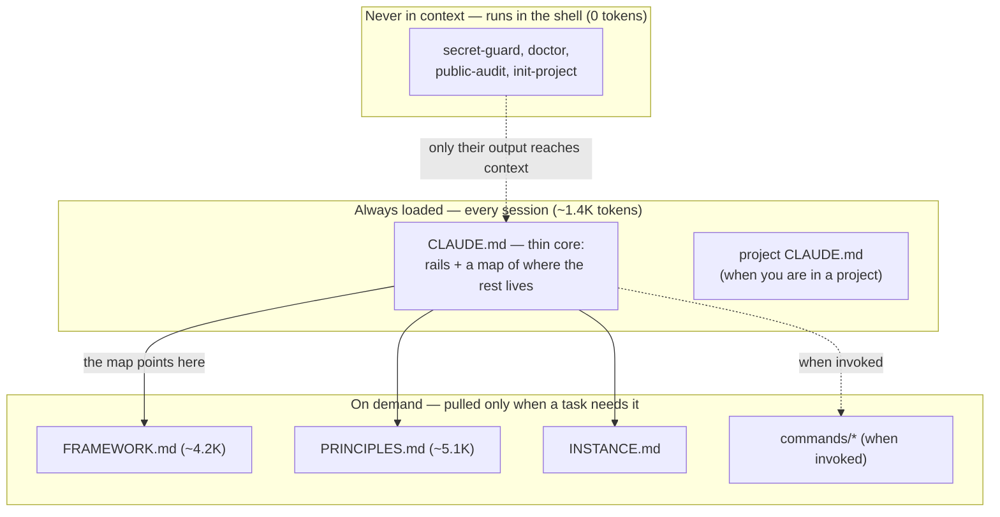

# Keel

[](https://github.com/dbudnikau-personal/keel/actions/workflows/ci.yml)
[](LICENSE)

> **In plain words:** a small "how I work" file your AI agent reads at the start of every session — so it
> stops re-learning your project, conventions, and past decisions — plus a few plain-Bash tools that block
> secrets and audit your setup. Model-agnostic; about 10 minutes to adopt.

**AI agents start every session cold** — re-deriving your project, your conventions, and decisions you
already made. Overcompensate by dumping everything into context and they drown in noise and grab the wrong
fact. Keel is the discipline in between: a thin, model-agnostic layer for **what an agent loads, when, and
how much** — so the judgment and project knowledge you accumulate don't depreciate every time the tools change.

> **Status: experimental probe.** This is an early, depersonalized extract of a working personal knowledge
> base. It is published to find out whether it's useful to anyone beyond its author — not as a finished
> product. Feedback welcome; expect rough edges.

> **Built and tested on Claude Code.** The principles, framework, and `tools/` are harness-independent; the
> commands assume a Claude-Code-style custom-command feature. To run Keel with another model or harness, see
> [`ADAPTING.md`](ADAPTING.md) — that's where "model-agnostic" becomes a concrete how-to (and where it stops).

## The idea

Keel rests on three ideas:

1. **Tiering** — a small, stable core is always loaded; everything else is pulled on demand. This is what
   makes it work even on small context windows.
2. **Durable vs disposable** — tools devalue in a year; your judgment and domain decisions don't. Invest in
   the durable layer; keep mechanism thin and replaceable.
3. **Build from friction** — every rule earns its place by solving a real, felt problem, never by wanting
   to be "complete." This is what keeps it from rotting into bureaucracy.

The foundation is in [`PRINCIPLES.md`](PRINCIPLES.md) (P0–P4); the reusable engine is in
[`FRAMEWORK.md`](FRAMEWORK.md). For exactly what loads when — and what tiering costs you in tokens, with a
with/without comparison — see [`docs/loading-and-cost.md`](docs/loading-and-cost.md).

### How it loads, at a glance



The always-loaded tier stays tiny; the heavy material (`PRINCIPLES`, `FRAMEWORK`) waits behind an on-demand
door; the tools never enter the model's context at all. That is the whole point of tiering.

## What's in the box

| | |
|---|---|
| `PRINCIPLES.md` | The durable foundation (P0–P4) — consult on foundational decisions. |
| `FRAMEWORK.md` | The reusable methodology: tiering, the registry-as-index, startup-footprint discipline, git/code conventions. Zero personal data. |
| `templates/CLAUDE.md` | The thin always-loaded core — copy into your harness (e.g. `~/.claude/`) and edit. |
| `templates/INSTANCE.md` | Your private personal layer (hardware, model access, project registry). |
| `templates/project-CLAUDE.md` | Per-project context template. |
| `templates/LEARNINGS.md` | Workflow-insight staging tier (the on-ramp between "promote to a rule" and "drop"). |
| `install.sh` | One-command bootstrap: copy the durable core into your harness home + wire the secret-guard hook. Idempotent — never clobbers existing files. |
| `tools/doctor.sh` | Structural self-audit of a project's knowledge-base baseline. |
| `tools/public-audit.sh` | Publication-readiness scan: hunts personal/instance leakage in the tree **and git history** (identities, private tokens) before a private→public flip. |
| `tools/secret-guard/` | A git-hook scanner that blocks key-shaped secrets on commit/push. A prefix-based backstop, not full DLP — it catches known key shapes (`ghp_`, `AKIA…`, `sk-…`, `glpat-`, …), not arbitrary secrets like an AWS *secret* key, a JWT, or a password. |
| `tools/init-project.sh` | Scaffold a new project to the baseline (born-compliant). |
| `commands/` | Lifecycle commands: `/init-project` (scaffold), `/go` (start a backlog task autonomously), `/wrap` (close a session — reconcile, changelog, backlog, capture), `/global-review` (cross-project audit + principles pass), `/backlog` (read-only backlog table). |
| `examples/` | A runnable, sandboxed 5-minute tour of the mechanized tools — `init-project` → `doctor` → `secret-guard` blocking a key, end to end. |
| `docs/loading-and-cost.md` | What loads when, why, and the per-session token cost — with a with/without-Keel comparison. |
| `docs/getting-started.md` | The fuller install + integration walk: what gets set up, how it folds into your day-to-day agent flow, how to tell it's working. |
| `docs/going-public.md` | The safe procedure to flip a private repo public: detect leaks (`public-audit`) → fix identity → scrub history → flip. The fix companion to `public-audit`. |

## What's mechanized vs what needs you

This is the honest part. A pure-prose principles file does **not** change an agent's behavior on its own —
loaded text nudges a model but neither enforces nor reliably activates; **the human is the trigger.**
Out-of-the-box behavior change comes only from the mechanized layer. So:

**Mechanized — works without you remembering to apply it:**
- `secret-guard` — blocks a key-shaped secret on commit/push (a git hook; fires by itself).
- `install` — bootstraps the core + wires the global hook in one command (run it; it sets up).
- `doctor` — reports baseline drift on demand (run it; it answers).
- `public-audit` — scans tree + git history for personal/instance leakage before going public (run it; it answers).
- `init-project` — scaffolds a compliant project (run it; it sets up).

**Needs you — prose that biases, but the human must apply:**
- `PRINCIPLES.md`, `FRAMEWORK.md`, the `CLAUDE.md` rails — these shape decisions *when read*, but nothing
  forces them. Treat them as a lens you invoke, not an autopilot.

Knowing which is which is the point: don't expect the principles to enforce themselves.

## Quickstart

```bash
# One command: copy the durable core into your harness home (~/.claude by default), wire the
# secret-guard hook machine-wide, seed a private INSTANCE.md, and verify. It never clobbers a
# file you already have, so re-running is safe.
./install.sh

# Then scaffold or audit a project:
tools/init-project.sh ~/path/to/project
tools/doctor.sh       ~/path/to/project
```

`./install.sh --home DIR` targets a non-Claude-Code harness; `--no-hooks` skips the global git
hook. To bootstrap by hand instead, copy `templates/CLAUDE.md`, `templates/INSTANCE.md`,
`FRAMEWORK.md`, and `PRINCIPLES.md` into `~/.claude/`, then run `tools/install-secret-guard.sh
--global`.

Want to see it work first, without touching anything? Run the sandboxed
[5-minute tour](examples/README.md): `examples/tour.sh`.

New here? The fuller walk — what gets set up, how it folds into your day-to-day agent flow, and how to tell
it's working — is in [`docs/getting-started.md`](docs/getting-started.md).

## Tests

The tools verify themselves — a zero-dependency bash suite (no bats, no deps) runs on every PR across
Linux and macOS, plus a `shellcheck` gate. A regression in any tool turns CI red.

```bash
tests/run.sh   # secret-guard block/allow/allowlist, doctor GAP/WARN/--registry,
               # init-project idempotency, install.sh bootstrap + clobber-guards
```

This is P1 applied to Keel itself: the methodology project is the first thing it audits.

## Scope

A reference / methodology repository, not a packaged product or a subscription. Built for Claude Code but
not tied to any one model or provider — see [`ADAPTING.md`](ADAPTING.md).

## License

Licensed under MIT (see [`LICENSE`](LICENSE)). Releases are tracked in [`CHANGELOG.md`](CHANGELOG.md).
