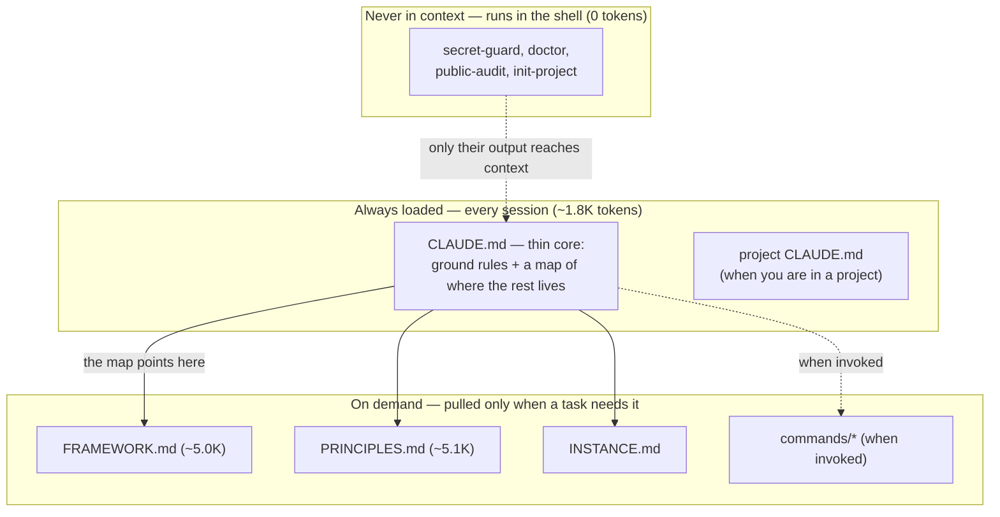

# Keel

[](https://github.com/rockerlabs/keel/actions/workflows/ci.yml)
[](LICENSE)

> ### Context isn't free — and most of yours is clutter.
> Bloated `CLAUDE.md` files and a junk-drawer `.claude/` load as ballast every session — burning
> tokens and burying the signal your assistant actually needs. **Keel keeps the always-on layer thin,
> and loads the rest only when a task needs it.**

Keel is a small *"how I work"* layer your AI coding assistant reads at the start of every session — the
ground rules, plus a map of where everything else lives — so it stops re-learning your project and
stops drowning in a context dump. Alongside it are a few zero-dependency Bash tools: a git hook that
blocks secrets and personal data, a setup checker, and a go-public audit. It's **tool-independent** —
works with any assistant, not just Claude Code — and takes about 10 minutes to set up.

**Built for the case where the clutter compounds:** you run an assistant across several projects on a
months-long horizon, and/or you're taking a private repo public. If that's you, read on.


## Install

Two steps, and the installer **never touches a file you own**.

**1. Clone and install:**

```bash
git clone https://github.com/rockerlabs/keel.git && cd keel && ./install.sh --link
```

`--link` wires everything by *reference* (symlinks + one import line): a later `git pull` in this clone
updates it all at once, and removal is fully enumerable. It also turns on the secret-guard git hook.
(Plain `./install.sh` makes a one-time copy instead — right for tools other than Claude Code.)

**2. Restart Claude Code and run `/keel-setup`** — the assistant finishes setup, no editing by hand.
It works even with **no projects yet**: it fills in your machine details and sets the ground rules.
Run it again inside each project you want Keel on (**not** the `keel` folder you just cloned): there it
**writes a first draft of that project's `CLAUDE.md` from its own code** — you *review* the draft, you
don't write it. (Don't see `/keel-setup`? You're in an old session — start a fresh one.)

*Want to see it work before installing?* `./examples/tour.sh` runs a safe demo in a throwaway sandbox
(touches nothing on your machine): it sets up a sample project and watches secret-guard block a
key-shaped secret.

<details>
<summary><strong>Other ways to install</strong> — one-liner, ask your agent, no git, pinned version</summary>

> **One line, no manual clone:**
>
> ```bash
> curl -fsSL https://raw.githubusercontent.com/rockerlabs/keel/main/bootstrap.sh | sh -s -- --link
> ```
>
> Clones Keel to `~/keel` (set `KEEL_DIR` to change) and links it; re-run anytime to update. Drop
> `--link` for a one-time copy.

> **Let your assistant install it.** On Claude Code (or the Claude desktop app), paste:
>
> > Install Keel from https://github.com/rockerlabs/keel — read its README install section and set it
> > up for me (linked mode if I have git), then tell me how to finish with `/keel-setup`.

| # | Flow | What you do | Needs git? | Auto-updates? | secret-guard? | Best for |
|---|------|--------------|:---:|:---:|:---:|----------|
| 1 | Manual, step by step | `git clone … && cd keel && ./install.sh --link` | yes | yes | yes | the default — inspect-first, full control |
| 2 | One line, terminal | `curl … \| sh -s -- --link` | optional | yes, with `--link` | yes, if git | fastest path — no manual clone |
| 3 | Ask your agent | one sentence to Claude Code (above) | agent decides | yes, if git | yes, if git | anyone already on Claude Code |
| 4 | Download & open (`.dmg`) | — | no | no | no | deferred — no real demand yet |

Two facts decide the columns: the *prose rails* are just text files (git isn't needed to place them),
but **secret-guard is a git hook** — no git, no guard (the `curl` path falls back to a tarball and
installs the rails-only half). Pin a release instead of latest `main` with `KEEL_REF=<tag>` — works on
every path. Full walk-through of each row, including the no-git fallback and version pinning →
[docs/getting-started.md](docs/getting-started.md).

</details>

## How it works

Keel rests on three plain ideas:

1. **Load a little always, the rest on demand** — a small stable core every session; everything else
   pulled in only when a task needs it.
2. **Some things last, some don't** — tools go out of date in a year; your judgment and project
   decisions don't. Invest in the lasting part, keep the machinery thin.
3. **Add a rule only when something hurts** — every rule must fix a real problem you actually ran into.
   That's what keeps a `CLAUDE.md` from rotting into a junk drawer.


```mermaid
flowchart TD
    subgraph always["Always loaded — every session (~1.8K tokens)"]
        core["CLAUDE.md — thin core:<br/>ground rules + a map of where the rest lives"]
        proj["project CLAUDE.md<br/>(when you are in a project)"]
    end
    subgraph demand["On demand — pulled only when a task needs it"]
        fw["FRAMEWORK.md (~5.0K)"]
        prin["PRINCIPLES.md (~5.1K)"]
        inst["INSTANCE.md"]
        cmd["commands/* (when invoked)"]
    end
    subgraph never["Never in context — runs in the shell (0 tokens)"]
        tools["secret-guard, doctor,<br/>public-audit, init-project"]
    end
    core -->|the map points here| fw
    core --> prin
    core --> inst
    core -.->|when invoked| cmd
    tools -.->|only their output reaches context| core
```

The foundation is in [`PRINCIPLES.md`](PRINCIPLES.md); the reusable how-to is in
[`FRAMEWORK.md`](FRAMEWORK.md). For exactly what loads when — and what it costs in tokens, with a
with/without comparison — see [`docs/loading-and-cost.md`](docs/loading-and-cost.md).

## What runs by itself, what only nudges

This is the honest part. A file full of good advice does **not**, on its own, change how your assistant
behaves — loaded text nudges it, but nothing forces it to follow.

- **Runs by itself:** the tools — **secret-guard** (a git hook that blocks key-shaped secrets and your
  listed personal data on commit/push), **public-audit** (scans files *and git history* before you flip
  a repo public), **install / doctor / init-project**. They fire whether or not anyone remembers them.
- **Up to you:** `PRINCIPLES.md`, `FRAMEWORK.md`, and the `CLAUDE.md` ground rules shape decisions
  *when read* — a lens you choose to look through, not an autopilot.

Knowing which is which is the point: the always-on layer keeps context lean; the tools do the enforcing.

## Just want the git hook?

The two safety tools work standalone — plain Bash + git, no Keel core, no config files, and they never
enter your assistant's context:

```bash
git clone https://github.com/rockerlabs/keel.git && cd keel
tools/install-secret-guard.sh --global   # every repo on this machine, from now on
```

- **secret-guard** blocks key-shaped secrets (`ghp_`, `AKIA…`, `sk-…`, `glpat-`, …) on every commit and
  push — and, opt-in, **your own personal data** (real name, emails, drive labels, serials) listed in a
  local never-committed file, caught even inside UTF-16 binary fixtures. It exists because exactly such a
  leak shipped in practice: test fixtures generated from a real device carried their owner's name, and a
  plain-text scan couldn't see it.
- **public-audit** (`tools/public-audit.sh <repo>`) scans a repo's files **and its git history** for
  personal and secret leaks before you flip it public — committer identities, tokens, names, home paths.


*One of the tools, ~40 seconds, nothing mocked: install the hook → an API key is blocked on commit →
your own name is blocked even inside a UTF-16 binary fixture. Reproduce it yourself:
[`docs/demo/record-demo.sh`](docs/demo/record-demo.sh) (sandboxed, touches nothing).*

## Good to know

> **"Isn't this just a well-written `CLAUDE.md`?"** Mostly, yes — and that's the point: one that's
> already written, installed in one command, tested on CI across three platforms, and disciplined enough
> to stay thin. Plus the guard rails a text file can't give you — the git hook and the go-public audit.

> **Not using Claude Code?** Keel doesn't depend on it. The ideas, the `tools/`, and the always-on file
> work with any AI coding tool (Cursor, Aider, Codex, a plain API agent, …); the one Claude-Code-specific
> bit is the slash commands. See [`ADAPTING.md`](ADAPTING.md).

> **Already have your own conventions?** Keel isn't all-or-nothing and won't fight your setup —
> `install.sh` never touches a file you own. Lift single ideas from
> [`PRINCIPLES.md`](PRINCIPLES.md)/[`FRAMEWORK.md`](FRAMEWORK.md) into your own `CLAUDE.md`, run the
> [standalone tools](#just-want-the-git-hook) next to what you have, or grab one `commands/*.md` and
> ignore the rest — a method to graft on, not a framework to adopt whole.

> **Status: early experiment.** A cleaned-up copy of one person's working setup, public to find out
> whether it helps anyone besides its author. Feedback welcome; expect rough edges.

## Docs

- [`docs/reference.md`](docs/reference.md) — **what's in the box**: every file, tool, and command at a glance.
- [`docs/getting-started.md`](docs/getting-started.md) — the longer setup walk-through, install flows, version pinning.
- [`docs/loading-and-cost.md`](docs/loading-and-cost.md) — what loads when and the per-session token cost.
- [`docs/going-public.md`](docs/going-public.md) — a safe step-by-step for making a private repo public.
- [`ADAPTING.md`](ADAPTING.md) — running Keel on tools other than Claude Code, with live cross-tool results.
- [`PRINCIPLES.md`](PRINCIPLES.md) · [`FRAMEWORK.md`](FRAMEWORK.md) — the foundation and the reusable how-to.

## Tests, scope, license

A small Bash test suite (no extra dependencies) runs on every change across Linux and macOS, plus a
`shellcheck` pass — `tests/run.sh` runs it locally. It's the same rule Keel asks of you, applied to Keel
itself.

Keel is a reference and method, not a packaged product or a subscription. Built for Claude Code but not
tied to any one model or tool — see [`ADAPTING.md`](ADAPTING.md).

Licensed under MIT (see [`LICENSE`](LICENSE)). Releases are tracked in [`CHANGELOG.md`](CHANGELOG.md).
