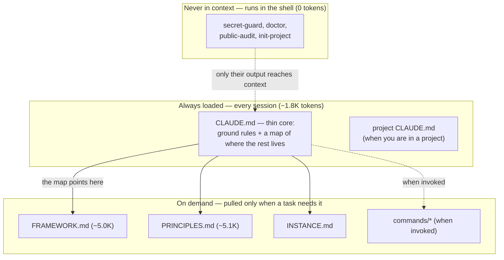

# Keel

[](https://github.com/rockerlabs/keel/actions/workflows/ci.yml)
[](LICENSE)

> ### Context isn't free — and most of yours is clutter.
> Bloated `CLAUDE.md` files and a junk-drawer `.claude/` load as ballast every session — burning
> tokens and burying the signal your assistant actually needs. **Keel keeps the always-on layer thin,
> and loads the rest only when a task needs it.**

Keel is a small *"how I work"* layer your AI coding assistant reads at the start of every session — the
ground rules, plus a map of where everything else lives — so it stops re-learning your project and
stops drowning in a context dump. Alongside it are a few zero-dependency Bash tools: a git hook that
blocks secrets and personal data, a setup checker, and a go-public audit. It's **tool-independent** —
works with any assistant, not just Claude Code — and takes about 10 minutes to set up.

**Built for the case where the clutter compounds:** you run an assistant across several projects on a
months-long horizon, and/or you're taking a private repo public. If that's you, read on.


## Install

Two steps. The first sets up the thin always-on file and turns on the secret-guard git hook — **without
ever touching a file you own.**

**1. Install.**

```bash
git clone https://github.com/rockerlabs/keel.git && cd keel && ./install.sh
```

> **On Claude Code, prefer `./install.sh --link`.** It wires everything by *reference* (symlinks + one
> import line), so a later `git pull` in this clone updates it all at once — and removal is fully
> enumerable (one folder, one import line, the command symlinks). Or skip the manual clone entirely:
>
> ```bash
> curl -fsSL https://raw.githubusercontent.com/rockerlabs/keel/main/bootstrap.sh | sh -s -- --link
> ```
>
> That clones Keel to `~/keel` (set `KEEL_DIR` to change) and links it; re-run anytime to update.
> [Details & trade-offs](docs/getting-started.md#linked-install--recommended-on-claude-code).

> **Even simpler — let your assistant install it.** On Claude Code (or the Claude desktop app), paste:
>
> > Install Keel from https://github.com/rockerlabs/keel — read its README install section and set it
> > up for me (linked mode if I have git), then tell me how to finish with `/keel-setup`.
>
> It clones, runs the installer with the right flags for your machine, and points you at the last step.

**2. Run `/keel-setup` and let the assistant finish setup — no editing by hand.** Restart Claude Code
(new commands only appear when a session starts) and run `/keel-setup` from anywhere, even with **no
projects yet** — it fills in your machine details and sets the ground rules. Run it again inside each
project you want Keel on (**not** the `keel` folder you just cloned): there it **writes a first draft of
that project's `CLAUDE.md` from its own code** — you *review* the draft, you don't write it.

```
/keel-setup
```

After step 1, secret-guard already protects your commits; `/keel-setup` does the rest, and you just
review what it drafts. (Don't see `/keel-setup`? You're in an old session — start a fresh one.)

*Want to see it work before installing?* `./examples/tour.sh` runs a safe demo in a throwaway sandbox
(touches nothing on your machine): it sets up a sample project and watches secret-guard block a
key-shaped secret.

### Which install flow fits you?

These aren't alternatives to weigh — they're doors sized to different users; pick the row that matches
you. Two facts decide everything: the *prose rails* are just text files (git isn't needed to place
them), but **secret-guard is a git hook** — no git, no guard. And **linked** (symlinks + one import
line; `git pull` updates everything) differs from **copy** (a snapshot that never updates on its own).

| # | Flow | What you do | Needs git? | Auto-updates? | secret-guard? | Best for |
|---|------|--------------|:---:|:---:|:---:|----------|
| 1 | Ask your agent | one sentence to Claude Code: "install Keel from github.com/rockerlabs/keel" | agent decides | yes, if git | yes, if git | anyone already on Claude Code — the agent handles every branch |
| 2 | One line, terminal | `curl … \| sh` (add `--link` to wire by reference) | optional | yes, with `--link` | yes, if git | fastest path — no manual clone |
| 3 | Manual, step by step | `git clone … && cd keel && ./install.sh --link` | yes | yes | yes | inspect-first, offline, or full control |
| 4 | Download & open (`.dmg`) | — | no | no | no | deferred — no real demand yet |

Full walk-through of each row → [docs/getting-started.md](docs/getting-started.md).

## What you actually get

This is the honest part. A file full of good advice does **not**, on its own, change how your assistant
behaves — loaded text nudges it, but nothing forces it to follow. **Real, out-of-the-box behavior change
comes only from the tools.** So Keel is two things, and it's worth knowing which is which:

**Runs by itself — works without you remembering:**
- **secret-guard** — a git hook that blocks a key-shaped secret, or your listed personal data, when you
  commit or push. Fires on its own, every time.
- **public-audit** — scans a repo's files *and its git history* for personal and secret leaks before you
  flip it public.
- **install / doctor / init-project** — set up the core, report what's missing, scaffold a project. Run
  them; they're done.

**Up to you — advice that nudges, but you apply it:**
- `PRINCIPLES.md`, `FRAMEWORK.md`, and the `CLAUDE.md` ground rules shape decisions *when read* — a lens
  you choose to look through, not an autopilot. Nothing makes the assistant obey.

Knowing which is which is the point: the always-on layer keeps context lean; the tools do the enforcing.

## The idea

Keel rests on three plain ideas:

1. **Load a little always, the rest on demand.** A small, stable core loads every session; everything
   else is pulled in only when a task actually needs it. That's what keeps context from bloating — and
   what lets it work even when the assistant's working memory is small.
2. **Some things last, some don't.** Tools go out of date in a year; your judgment and project decisions
   don't. Put your effort into the lasting part, and keep the machinery thin and easy to swap out.
3. **Add a rule only when something hurts.** Every rule has to fix a real problem you actually ran into —
   not just be there to look complete. That's what keeps a `CLAUDE.md` from rotting into a junk drawer.

The foundation is in [`PRINCIPLES.md`](PRINCIPLES.md); the reusable how-to is in
[`FRAMEWORK.md`](FRAMEWORK.md). For exactly what loads when — and what it costs in tokens, with a
with/without comparison — see [`docs/loading-and-cost.md`](docs/loading-and-cost.md).

### How it loads, at a glance


```mermaid
flowchart TD
    subgraph always["Always loaded — every session (~1.8K tokens)"]
        core["CLAUDE.md — thin core:<br/>ground rules + a map of where the rest lives"]
        proj["project CLAUDE.md<br/>(when you are in a project)"]
    end
    subgraph demand["On demand — pulled only when a task needs it"]
        fw["FRAMEWORK.md (~5.0K)"]
        prin["PRINCIPLES.md (~5.1K)"]
        inst["INSTANCE.md"]
        cmd["commands/* (when invoked)"]
    end
    subgraph never["Never in context — runs in the shell (0 tokens)"]
        tools["secret-guard, doctor,<br/>public-audit, init-project"]
    end
    core -->|the map points here| fw
    core --> prin
    core --> inst
    core -.->|when invoked| cmd
    tools -.->|only their output reaches context| core
```

The always-on part stays tiny; the bigger files (`PRINCIPLES`, `FRAMEWORK`) wait behind a door and load
only when needed; the tools never enter the assistant's memory at all. That's the whole point.

## Just want the git hook?

The two safety tools work standalone — plain Bash + git, no Keel core, no config files, and they never
enter your assistant's context:

```bash
git clone https://github.com/rockerlabs/keel.git && cd keel
tools/install-secret-guard.sh --global   # every repo on this machine, from now on
```

- **secret-guard** blocks key-shaped secrets (`ghp_`, `AKIA…`, `sk-…`, `glpat-`, …) on every commit and
  push — and, opt-in, **your own personal data** (real name, emails, drive labels, serials) listed in a
  local never-committed file, caught even inside UTF-16 binary fixtures. It exists because exactly such a
  leak shipped in practice: test fixtures generated from a real device carried their owner's name, and a
  plain-text scan couldn't see it.
- **public-audit** (`tools/public-audit.sh <repo>`) scans a repo's files **and its git history** for
  personal and secret leaks before you flip it public — committer identities, tokens, names, home paths.


*One of the tools, ~40 seconds, nothing mocked: install the hook → an API key is blocked on commit →
your own name is blocked even inside a UTF-16 binary fixture. Reproduce it yourself:
[`docs/demo/record-demo.sh`](docs/demo/record-demo.sh) (sandboxed, touches nothing).*

## Reference: what's in the box

| | |
|---|---|
| `PRINCIPLES.md` | The lasting foundation — the handful of ideas everything else rests on. Read it for big, hard-to-undo decisions. |
| `FRAMEWORK.md` | The reusable how-to: load-a-little-always, the project list, keeping the always-on part small, plus git and code conventions. No personal data. |
| `CORE.md` | The always-on rails by themselves — no placeholders, nothing personal. On Claude Code you can import it live from your own file instead of copying (`git pull` in the checkout then refreshes the rails); the template below embeds it verbatim for everyone else. |
| `templates/CLAUDE.md` | The small always-on file — copy it into your AI tool's config folder (e.g. `~/.claude/`) and edit it. It's `CORE.md` embedded verbatim plus the personal sections you fill in (the file map, your preferences). |
| `templates/INSTANCE.md` | Your private personal layer (hardware, which models you can use, your list of projects). |
| `templates/project-CLAUDE.md` | A template for per-project notes. |
| `templates/LEARNINGS.md` | A holding place for workflow tips that aren't yet worth a full rule (between "make it a rule" and "drop it"). |
| `install.sh` | One-command setup: copies the always-on files into your config folder (or, with `--link`, wires them as symlinks + one import line) and turns on the secret-guard check. Safe to re-run — never touches your own files; offers to update Keel's own core if it's drifted, asking first. |
| `tools/doctor.sh` | Checks a project's setup for missing pieces. |
| `tools/public-audit.sh` | Before you make a private repo public, scans the files **and the git history** for things that shouldn't leak. A committer identity or a declared private token is a hard stop; names, emails and home paths in file content are flagged for you to review. |
| `tools/secret-guard/` | A git check that blocks key-shaped secrets when you commit or push — and, opt-in, your personal data (name, drive labels, emails, serials) listed in a local never-committed file, caught even inside UTF-16 binary fixtures. It's a safety net for known key shapes (`ghp_`, `AKIA…`, `sk-…`, `glpat-`, …) plus your listed literals, not a catch-all — it won't catch arbitrary secrets like an AWS *secret* key, a JWT, or a password. On push it also blocks agent session-metadata trailers (a `Claude-Session`-style line) in the pushed commits' messages, and scans annotated-tag messages against all of the above. |
| `tools/init-project.sh` | Sets up a new project with the basics in place, and adds it to your `INSTANCE.md` project list. |
| `tools/register-project.sh` | Adds existing project folder(s) to the `INSTANCE.md` project list — one line each, safe to re-run: `register-project.sh <path>…`. |
| `commands/` | Commands you can run: `/keel-setup` (lets the assistant finish setup — fills your machine details and drafts a project's `CLAUDE.md` from its code), `/init-project` (set up a project), `/context-dump` (onboard an existing, undocumented codebase by actually reading it), `/go` (start a backlog task on its own), `/wrap` (close out a session — tidy up notes, changelog, backlog), `/global-review` (review across all projects), `/backlog` (show the backlog), `/keel-score` (score how much Keel shaped a session — derived from cited events, not asserted). |
| `tools/keel-impact.sh` | Optional per-project tracker behind `/keel-score`: an append-only, auditable ledger of cited fire/hit/miss/friction events. Opt-in (`keel-impact.sh enable <dir>`); off by default. |
| `examples/` | A runnable, safe 5-minute tour of the tools — `init-project` → `doctor` → `secret-guard` blocking a key, start to finish. |
| `docs/loading-and-cost.md` | What loads when, why, and the per-session token cost — with a with/without-Keel comparison. |
| `docs/getting-started.md` | The longer setup walk-through: what gets set up, how it fits into your day-to-day, and how to tell it's working. |
| `docs/going-public.md` | A safe step-by-step for making a private repo public: find leaks (`public-audit`) → fix names → clean history → flip. |

`./install.sh --home DIR` sets Keel up for an AI tool other than Claude Code; `--no-hooks` skips the git
check. To set it up by hand instead, copy `templates/CLAUDE.md`, `templates/INSTANCE.md`, `FRAMEWORK.md`,
and `PRINCIPLES.md` into `~/.claude/`, then run `tools/install-secret-guard.sh --global`.

## Good to know

> **"Isn't this just a well-written `CLAUDE.md`?"** Mostly, yes — and that's the point: one that's
> already written, installed in one command, tested on CI across three platforms, and disciplined enough
> to stay thin instead of bloating. Plus the guard rails a text file can't give you — a git hook that
> blocks secrets and personal data, and an audit for taking a repo public.

> **Not using Claude Code?** Keel doesn't depend on it. The ideas, the `tools/`, and the always-on file
> work with any AI coding tool (Cursor, Aider, Codex, a plain API agent, …). The one Claude-Code-specific
> bit is the slash commands. See [`ADAPTING.md`](ADAPTING.md) for a short non-Claude setup — and, if you
> get it running on another tool, a quick way to share how.

> **Already have your own conventions?** Keel isn't all-or-nothing, and it won't fight your setup —
> `install.sh` never touches a file you own. Take only what's useful:
>
> - **The ideas.** Read [`PRINCIPLES.md`](PRINCIPLES.md) and [`FRAMEWORK.md`](FRAMEWORK.md) and lift what
>   fits into your *own* `CLAUDE.md`. Load-a-little-always, durable-vs-disposable, build-from-friction
>   port to any setup — you don't need Keel's files to use them.
> - **The standalone tools.** `secret-guard` and `public-audit` run next to whatever you already use —
>   no Keel "core" required; see [Just want the git hook?](#just-want-the-git-hook) above.
> - **One piece at a time.** Grab a single `commands/*.md` or a template and ignore the rest.
>
> Keel is a method and a few tools you graft onto what you have — not a framework you adopt whole.

> **Status: early experiment.** This is an early, cleaned-up copy of one person's working setup. It's
> public to find out whether it helps anyone besides its author — not as a finished product. Feedback
> welcome; expect rough edges.

## Tests

The tools check themselves — a small Bash test suite (no extra dependencies) runs on every change across
Linux and macOS, plus a `shellcheck` pass. If any tool breaks, the tests go red.

```bash
tests/run.sh   # secret-guard block/allow/allowlist, doctor checks,
               # init-project re-run safety, install.sh setup + don't-overwrite guards
```

It's the same rule Keel asks of you, applied to Keel itself: the project is the first thing it checks.

## Scope

A reference and method, not a packaged product or a subscription. Built for Claude Code but not tied to
any one model or tool — see [`ADAPTING.md`](ADAPTING.md).

## License

Licensed under MIT (see [`LICENSE`](LICENSE)). Releases are tracked in [`CHANGELOG.md`](CHANGELOG.md).
